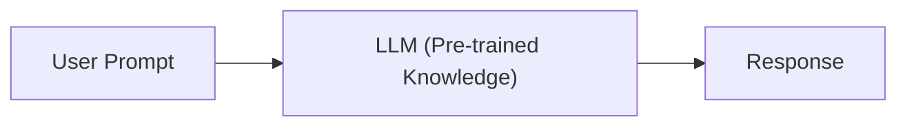
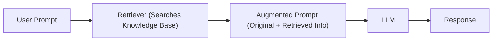
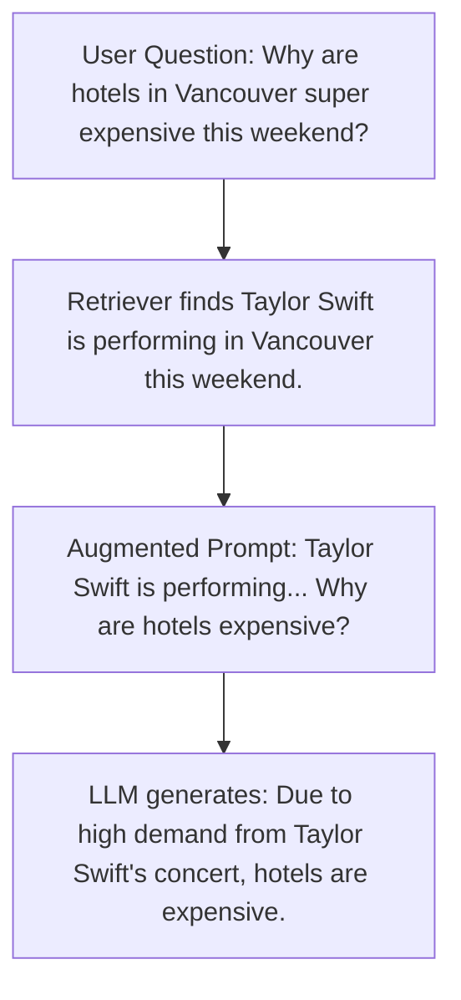

[Previous](./Readme.md) | [Home](./Readme.md) | [Next](./2_Applications_Of_RAG.md)

## Large Language Models (LLMs)

**Capabilities:** Answer questions, summarize/rewrite text, generate code, and more.

**Limitation:** Relies solely on pre-trained knowledge, which may lack recent or specialized information.

## Retrieval-Augmented Generation (RAG)

**Purpose:** Enhances LLM performance by providing additional, relevant information during the response generation process.

### Two-Phase Process:

1. **Retrieval:** Collect relevant information from a knowledge base.
2. **Generation:** Use the retrieved information to generate accurate responses.

### Why RAG is Needed

LLMs cannot know everything (e.g., recent events, private databases, or niche topics).

RAG ensures LLMs have access to the most relevant and up-to-date information.

### Traditional LLM Workflow

### RAG Workflow

### Example of RAG in Action

## Example Applications

- **Recent Events:** Answer questions about news not in the LLM's training data.
- **Specialized Domains:** Provide accurate responses in fields like medicine or law by retrieving domain-specific documents.
- **Private Data:** Enable LLMs to use internal company data securely.

## Key Takeaways

- RAG bridges the gap between an LLM's pre-trained knowledge and real-world, up-to-date information.
- The retriever acts as a "librarian," fetching relevant data for the LLM to use.
- RAG is especially useful for dynamic or specialized queries where LLMs alone would fall short.

[Previous](./Readme.md) | [Home](./Readme.md) | [Next](./2_Applications_Of_RAG.md)

                                                                    
