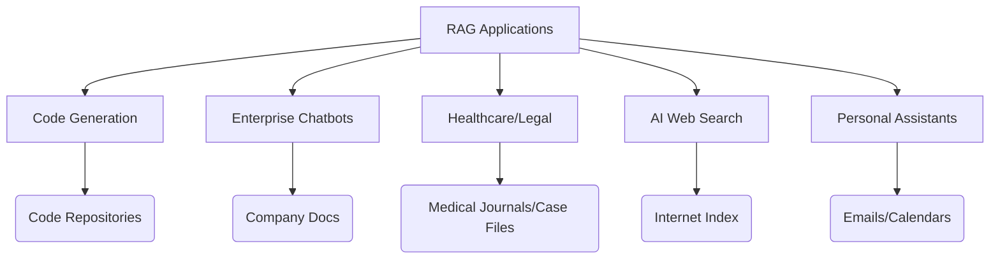

# Core Principle

Combines off-the-shelf LLMs with custom knowledge bases to:

- Fill gaps in the LLM’s training data
- Provide domain-specific or real-time information

## Key Applications

1. **Code Generation**  
   - **Problem:** LLMs lack project-specific context (e.g., internal classes, coding styles).  
   - **Solution:**  
     - Use the code repository as a knowledge base.  
     - Retrieve relevant files/definitions to:  
       - Generate accurate code snippets  
       - Answer project-specific questions  

2. **Enterprise Chatbots**  
   - **Use Cases:**  
     - **Customer Service:**  
       - Product info, inventory status, troubleshooting  
     - **Internal Tools:**  
       - HR policies, documentation navigation  
   - **Benefits:**  
     - Grounds responses in company-specific data  
     - Reduces generic/misleading outputs  

3. **Healthcare & Legal Domains**  
   - **Why RAG?**  
     Precision-critical fields require niche/private data (e.g., medical journals, case files).  
     Traditional LLMs lack access to:  
     - Proprietary research  
     - Confidential client data  
   - **Example:**  
     - Diagnosing rare conditions with latest studies  
     - Legal case analysis with jurisdiction-specific precedents  

4. **AI-Assisted Web Search**  
   - **Modern Search Engines:**  
     - **Retriever:** Finds relevant websites (traditional search).  
     - **Generator:** Summarizes results using RAG (e.g., Google’s AI overviews).  
     - **Knowledge Base:** The entire internet (filtered for reliability).  

5. **Personalized Assistants**  
   - **Context Sources:**  
     - Emails, calendars, contact lists, project docs  
   - **Advantages:**  
     - Small but dense knowledge bases improve relevance.  
     - Enables hyper-personalized support (e.g., drafting emails, scheduling).  

## Why RAG Matters

- **Overcomes LLM Limitations:**  
  - No dependency on training data recency/coverage.  
- **Enables New Use Cases:**  
  - From healthcare diagnostics to personalized productivity tools.  
- **Scalability:**  
  - Works for both large-scale (enterprise) and small-scale (personal) systems.  

## Key Takeaways

- RAG is not a one-size-fits-all solution but a flexible framework.  
- **Ideal for:**  
  - Dynamic information (e.g., news, codebases).  
  - Specialized/private data (e.g., medical, legal).  
  - Personalization (e.g., emails, documents).  
- **Look for opportunities where:**  
  - Your data exists but isn’t in the LLM’s training set.

[Previous](./1_Introduction_To_RAG.md) | [Home](./Readme.md) | [Next](./3_RAG_Architecture.md)
