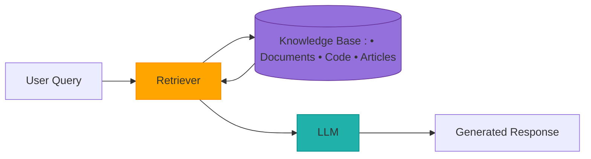
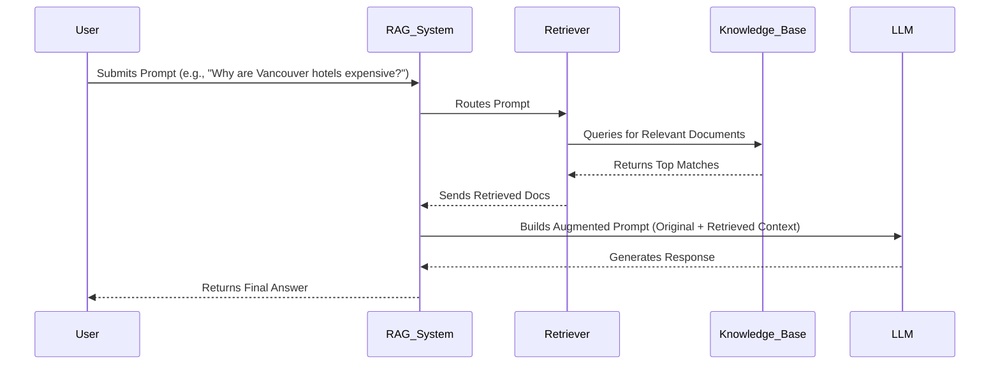

# RAG Architecture: Detailed Summary
*Components, Workflow, and Advantages*

## Core Components
- LLM
- Retriever
- Knowledge Base



## Step-by-Step Process

1. **User Prompt:** Submitted to RAG system (identical to standalone LLM usage).

2. **Retrieval Phase:**
   - Retriever searches knowledge base (e.g., vector DB) for contextually relevant documents.

3. **Augmentation:**
   - Original prompt + retrieved documents → Combined into a single enriched prompt.

4. **Example Augmented Prompt:**
   ```text
   Answer using this context:
   - "Taylor Swift concert in Vancouver this weekend (Source: NewsAPI 2023-11-02)"
   - "Hotel occupancy rates hit 98% during major events (Source: CityReport 2023)"

   Question: Why are Vancouver hotels expensive this weekend?
   ```

5. **Generation:**
   - LLM processes augmented prompt to produce a grounded response.

### Workflow



## Key Advantages of RAG

| Advantage               | Explanation                                                                       |
|-------------------------|-----------------------------------------------------------------------------------|
| Access to Unseen Data   | Integrates private/real-time data not in LLM’s training set (e.g., latest news).  |
| Reduces Hallucinations  | Grounds responses in retrieved facts, not just pre-trained patterns.              |
| Dynamic Updates         | Update knowledge base instantly (no LLM retraining needed).                      |
| Source Citations        | Enables LLM to cite references (e.g., "According to NewsAPI...").                |
| Efficiency              | Retriever handles "fact-finding," letting LLM focus on generation.                |

## Example Code Snippet (Pseudocode)

```python
def retrieve(query: str) -> list[str]:
    """Searches knowledge base for relevant documents."""
    return vector_db.search(query, top_k=3)

def generate(prompt: str, context: list[str]) -> str:
    """Generates response using augmented prompt."""
    augmented_prompt = f"Context: {context}\n\nQuestion: {prompt}"
    return llm.generate(augmented_prompt)

# Usage:
prompt = "Why are Vancouver hotels expensive this weekend?"
context = retrieve(prompt)
response = generate(prompt, context)
```

## Key Takeaways

- **User Experience:** Identical to standalone LLM (input prompt → output response).
- **Critical Addition:** Retriever bridges LLM’s knowledge gaps with external data.
- **Flexibility:** Works for both structured (DBs) and unstructured (documents) data.
