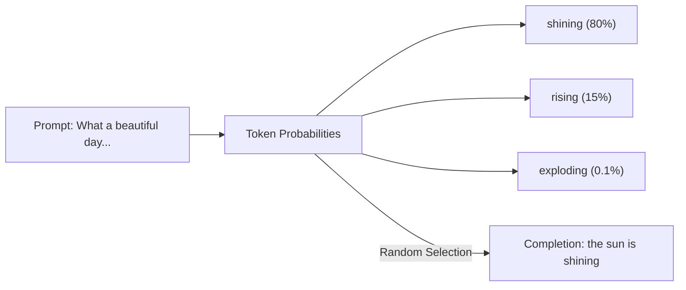
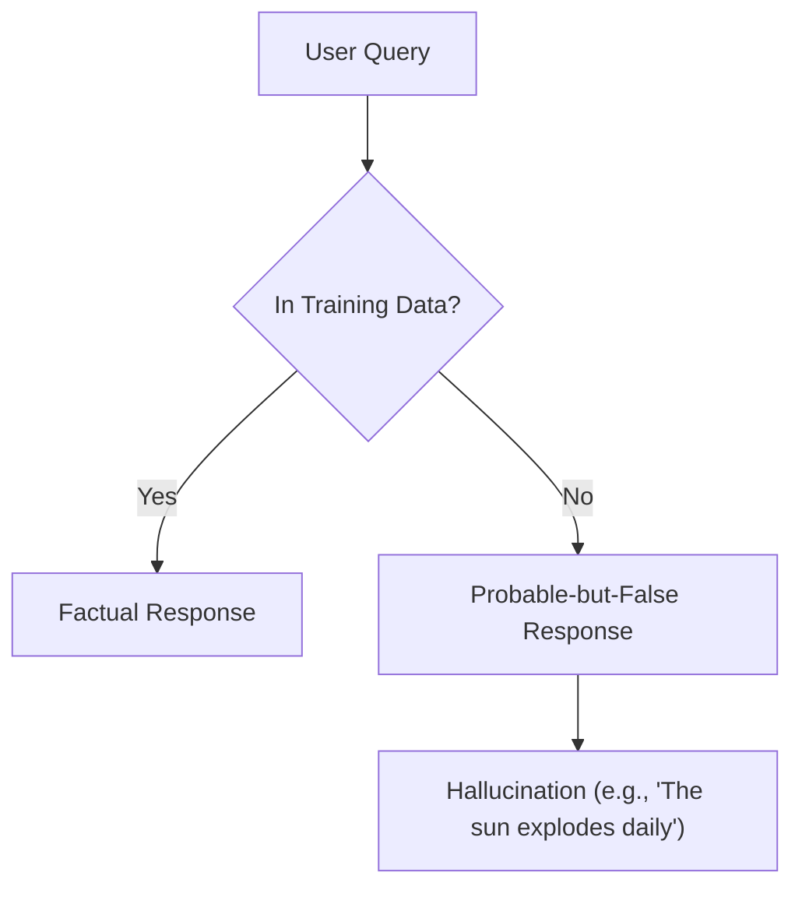
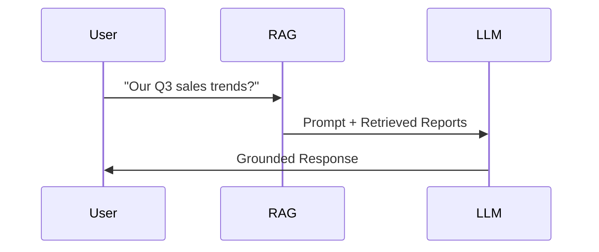

# How Large Language Models (LLMs) Work
*Core Concepts and RAG Integration*

## 1. LLM Basics: "Fancy Autocomplete"

**Key Properties:**
- **Token-by-Token Generation:** Predicts next word piece (token) based on probability
- **Vocabulary:** 10K-100K tokens (words/subwords/punctuation)
- **Autoregressive:** Each new token depends on previous choices

## 2. Training Process

**How LLMs Learn:**
- **Exposure:** Shown trillions of text snippets
- **Prediction Task:** Guess missing words in sentences
- **Parameter Updates:** Adjusts billions of numerical weights

## 3. Limitations & Hallucinations

**Why Hallucinations Occur:**
- LLMs optimize for likely not true text
- No built-in fact-checking mechanism

## 4. RAG to the Rescue

**How RAG Fixes LLM Limitations:**
- **Knowledge Gaps:** Provides missing data via retrieval
- **Hallucination Control:** Anchors responses in documents
- **Dynamic Updates:** No retraining needed

## Key Takeaways

- **LLMs ≠ Knowledge Bases:** They're statistical text predictors
- **Context Window Limits:** Typical range: 4K-1M tokens
- **RAG Synergy:** Retrievers feed LLMs precise data when needed
