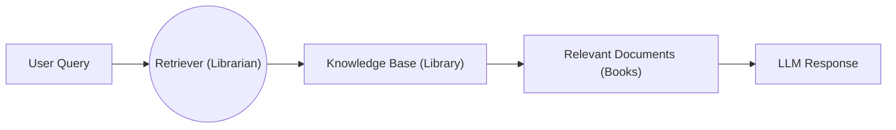
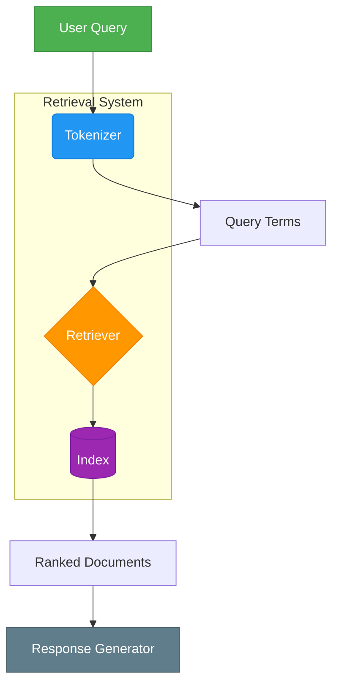
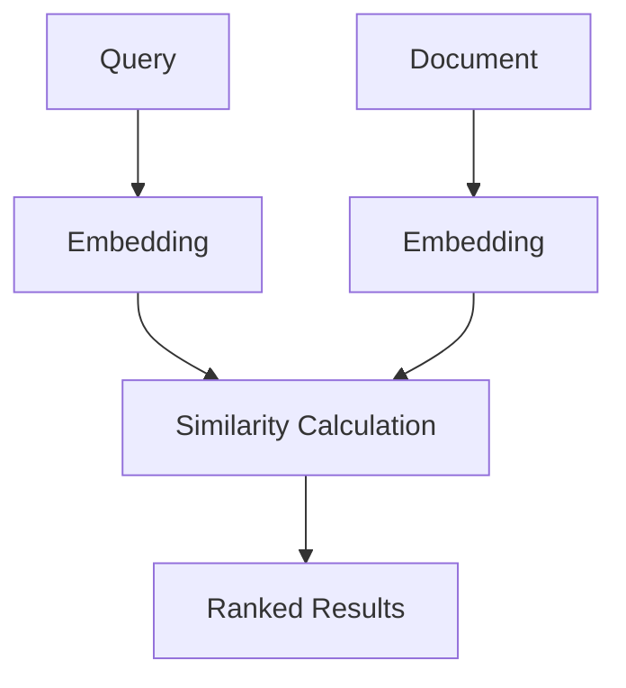
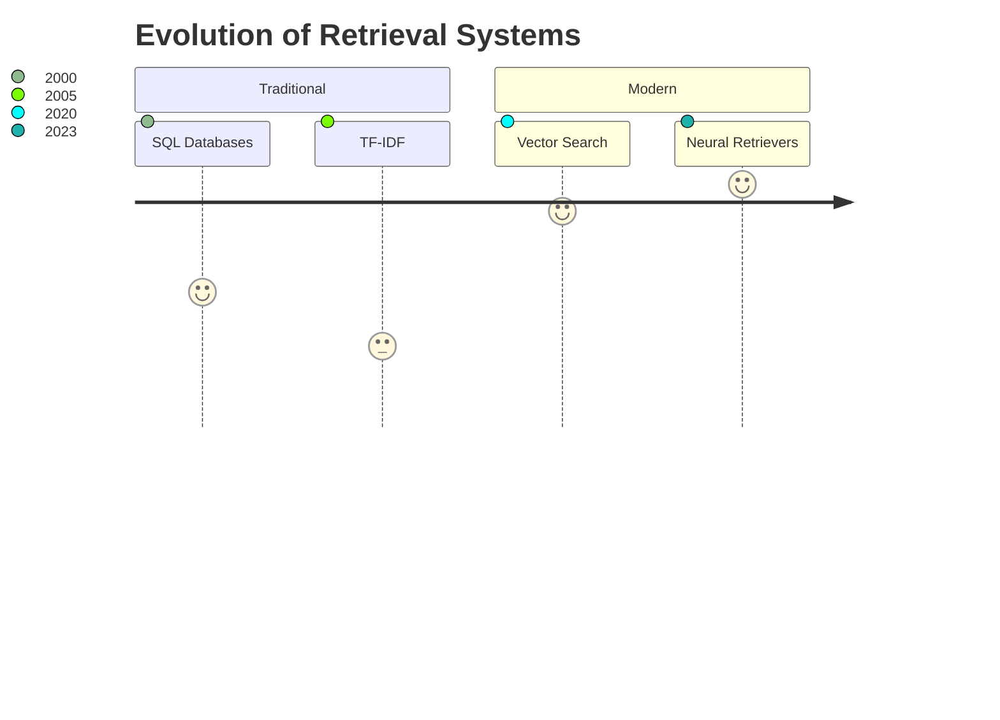
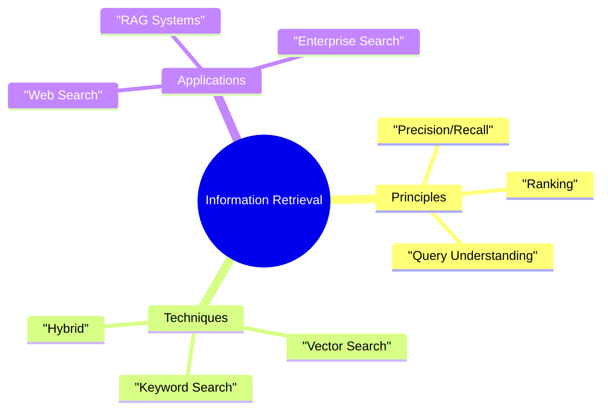

# Introduction to Information Retrieval
*Core Concepts for RAG Systems*

## 1. The Retrieval Process

**Key Analogy:**
- **Librarian** = Retriever algorithm
- **Library Sections** = Vector index
- **Book Recommendations** = Top-K document retrieval

## 2. Core Components

## 3. Relevance Scoring

**Scoring Methods:**
- Cosine similarity
- BM25 (traditional IR)
- Hybrid scoring

## 4. Precision vs. Recall Tradeoff

**Operational Challenges:**
- Avoiding false positives (irrelevant docs)
- Preventing false negatives (missed relevant docs)

## 5. Modern Implementations

**Key Technologies:**
- Vector Databases (Pinecone, Weaviate)
- Dense Retrievers (DPR, ColBERT)
- Hybrid Search (Combining keywords + vectors)

## Key Takeaways

**Fundamental Goal:**
> "Find the most relevant information for a query from large collections"

**RAG Integration:**
- Retrievers act as LLM's "research assistants"

**Critical Metrics:**

| Metric    | Ideal Target |
|-----------|--------------|
| Precision | >80%         |
| Recall    | >90%         |
| Latency   | <100ms       |

**Implementation Checklist:**
- Design document processing pipeline
- Choose indexing strategy (inverted index, HNSW)
- Select scoring/ranking approach
- Optimize top-K retrieval

## Visual Summary

