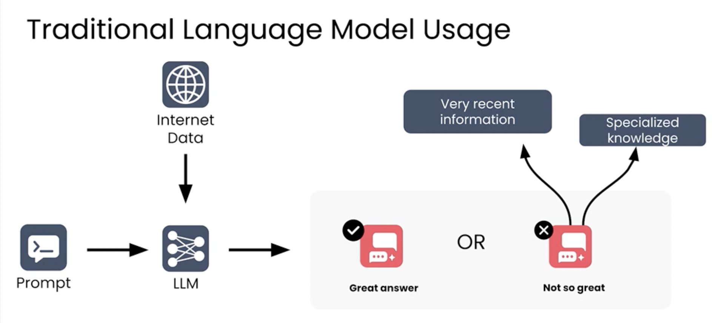

# Retrieval Augmented Generation (RAG) 

LLMs are already powerful :
    - Summarize the Text
    - Generate Code
    - Rewrite Content

RAG further improves them by 
    - by giving them access to information that they dont know

In RAG, 
Retrieval : the process of collecting useful information is called retrieval
Generation : the process of reasoning over that information and responding 

