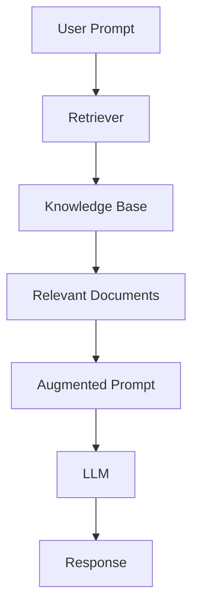

# 📘 Module 1: Introduction to Retrieval-Augmented Generation (RAG)

> _By Zain Hasan | DeepLearning.AI_

---

## 📋 Module Overview

- **Introduction to RAG**
- **RAG Architecture Deep Dive**
- **Real-World Applications**

---

## 🛠️ Hands-on Project Modules

- **Module 1**: Basic RAG
- **Module 2**: Retriever
- **Module 3**: Vector Database
- **Module 4**: LLM
- **Module 5**: Monitoring & Evaluation

---

## 🔍 What is RAG?

Retrieval-Augmented Generation (RAG) enhances LLMs by providing access to **new, external knowledge**, enabling better:

- Text Summarization  
- Code Generation  
- Content Rewriting  

**RAG = LLM + Relevant External Information**

---

## 🧠 Motivation Example

**Why are hotels expensive on weekends?**  
_“More people travel on weekends, so there's more competition for rooms.”_

**Why are hotels in Vancouver expensive this coming weekend?**  
→ _Taylor Swift is in town._

**Why doesn’t Vancouver have more hotel capacity?**  
→ _Zoning laws, high land costs, historical urban planning constraints._

---

## 🧭 Two-Step Answering Process

| Step        | Description |
|-------------|-------------|
| **Retrieval**   | Collect Information |
| **Generation** | Reason & Respond |

Simple questions require no retrieval. Complex ones benefit from extensive research.

---

## 🧓 Traditional LLM Usage

- Trained on large-scale **Internet data**: forums, code, books
- Performs poorly on:
  - Recent events
  - Confidential/private data
  - Niche knowledge

---

## 🧩 What LLMs Miss

- **Private Databases** → Inaccessible  
- **Hard-to-Find Information** → Not widely available online  
- **Real-Time Data** → Not part of training  

**Solution: Prompt Augmentation with External Info**

---

## ✍️ RAG in Action

**Input:**  
“Why are hotels in Vancouver expensive this weekend?”

**Augmented Prompt via RAG:**  
“Taylor Swift is performing in Vancouver, Dec 6–8, 2024.”

**LLM Output:** Accurate, context-grounded response.

---

## 📂 RAG System Components

### 🔎 Retriever
- Manages and searches a **knowledge base**
- Finds **relevant documents**
- Sends them to the LLM for generation

---

## 💡 Applications of RAG

### 🧑‍💻 Code Generation
- Uses your **codebase** as context  
- Improves LLM-generated code snippets and explanations

### 💬 Company Chatbots
- Customized using **internal docs**
- Aligns with product/service language and FAQs

### ⚖️ Specialized Knowledge
- Useful in **legal** and **medical** domains  
- Secures and grounds sensitive information

### 🌍 Internet-Based Retrieval
- Summarizes search engine results  
- Real-time augmentation for up-to-date answers

### 👤 Personalized Assistants
- Uses your **emails, messages, calendar events**  
- Improves LLM responses with personal context

---

## 🧱 RAG Architecture

- Adds latency, but improves answer quality
- Keeps LLM responses **grounded and factual**

---

## ✅ Advantages of RAG

- Injects **missing knowledge**
- Reduces **hallucinations**
- Keeps models **up to date**
- Enables **source citation**
- Separates **retrieval** from **generation**

---

## 🧠 Introduction to LLMs

- **LLMs = Fancy Autocomplete**
- Predict next token based on:
  - Token probabilities
  - Language patterns
  - Contextual understanding

### 🔁 Autoregressive Nature
- Each token influences the next
- Same prompt can yield different results

---

## 🧪 How LLMs Learn

- Trained on **billions of parameters**
- Learn from massive text corpora
- Update weights based on prediction accuracy

---

## ❌ Why LLMs Hallucinate

- Predicts **probable** outputs, not always **truthful** ones
- Lacks real-time or private context
- Gaps in training data = plausible but wrong outputs

---

## ✅ How RAG Solves This

**LLM + Retriever + Knowledge Base → Grounded, reliable answers**

---

## 🚫 Why Not Just Add All Info?

| Issue              | Explanation |
|-------------------|-------------|
| **High Compute Cost** | More tokens = slower inference |
| **Context Limit**     | LLMs have token limits |

→ Hence the need for a **Retriever** that selects only what matters.

---

## 📚 Retrieval Analogy: The Librarian

- **Library** = Knowledge Base  
- **Librarian** = Retriever  
- **Search Index** = Organizational structure  
- Efficiently returns most relevant "books" (chunks of data)

---

## ⚖️ Retriever Tradeoffs

- Precision vs Recall
- Risk of:
  - Returning too many irrelevant docs
  - Returning too few and missing critical info
- Requires tuning and monitoring

---

## 🧮 Practical Databases

- **Relational Database**: Structured rows/tables  
- **Vector Database**: Specialized for RAG and similarity search

---

## 📌 Key Takeaways

- RAG enhances LLMs with **external, targeted information**
- Helps overcome:
  - Limited training data
  - Hallucinations
  - Outdated content
- Retrieval and generation are **decoupled** for better control
