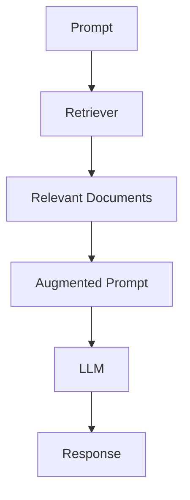

# 📘 Module 2: Information Retrieval Foundations

> _By Zain Hasan | DeepLearning.AI_

---

## 📋 Module Overview

- Retrieval techniques (keyword, semantic, metadata filtering)
- Theoretical underpinnings of each
- Evaluation strategies and metrics
- Hands-on coding assignment

---

## 🔄 Retriever Architecture



---

## 🔍 Retrieval Techniques

### 1. **Keyword Search**
- Matches **exact words** from prompt.
- Based on **TF-IDF** and **BM25** scoring.

### 2. **Semantic Search**
- Uses **vector similarity** to match **meanings**, not just words.
- Powered by **embedding models**.

### 3. **Metadata Filtering**
- Uses criteria like date, author, tags to include/exclude docs.
- Fast and precise, but **not search** by itself.

---

## ⚖️ Hybrid Search

Combines:
- **Keyword Search** (precise)
- **Semantic Search** (flexible)
- **Metadata Filtering** (restrictive)

**High-performing retrievers balance all three**.

---

## 🧮 Keyword Search: TF-IDF

- **Term Frequency (TF)**: Count of keyword in document
- **Inverse Document Frequency (IDF)**: Rarity of keyword across corpus
- Formula: `TF * log(total_docs / docs_with_term)`

**Strengths**: Simple, guaranteed keyword match  
**Weaknesses**: Can't handle synonyms or context

---

## 🔬 Keyword Search: BM25

BM25 refines TF-IDF:
- **TF Saturation**: Diminishing returns for repeated terms
- **Doc Length Normalization**: Avoids penalizing long docs

**Tunable Parameters**:
- `k₁`: TF impact (1.2–2.0)
- `b`: Length normalization (0–1)

---

## 🧠 Semantic Search

### ✨ Embedding Models

- Map words/sentences/docs to points in **high-dimensional space**
- Similar meanings → close vectors

### 🔧 Training via Contrastive Learning

- Pull similar pairs together
- Push dissimilar pairs apart
- Uses positive & negative examples to shape vector space

---

## 📏 Vector Comparison Techniques

| Method              | Description                                      |
|---------------------|--------------------------------------------------|
| **Dot Product**      | Measures projection length                      |
| **Cosine Similarity**| Measures directional alignment (-1 to +1)      |
| **Euclidean Distance**| Measures literal space between points         |

---

## 🧪 Hybrid Scoring Strategy

### ✅ **Reciprocal Rank Fusion (RRF)**

```math
1 / (k + rank_1) + 1 / (k + rank_2) + ...
```

- Combines ranked outputs from keyword & semantic searches
- `k` adjusts dominance of high-rank items

---

## 🎛️ Tuning Search Balance

### β = Semantic vs. Keyword
- β = 0.8 → 80% semantic, 20% keyword
- Lower β favors keyword accuracy

---

## 📏 Evaluation Metrics for Retrieval

| Metric       | Description |
|--------------|-------------|
| **Precision**   | % of retrieved docs that are relevant |
| **Recall**      | % of relevant docs that were retrieved |
| **MAP**         | Mean of precision values at ranks of relevant docs |
| **MRR**         | Mean Reciprocal Rank of first relevant doc |

---

## 🔁 Metric Examples

- **Precision@K**: Relevant out of K results  
- **Recall@10**: % of relevant docs found in top 10  
- **MAP@K**: Average precision across prompts  
- **MRR**: 1 / rank of first relevant document

---

## 📌 Module Summary

- **Keyword Search**: Exact word match  
- **Semantic Search**: Embedding-based similarity  
- **Metadata Filtering**: Boolean filtering  
- **Hybrid Search**: Combines the above  
- **Evaluation**: Use precision, recall, MAP, MRR to benchmark

---
